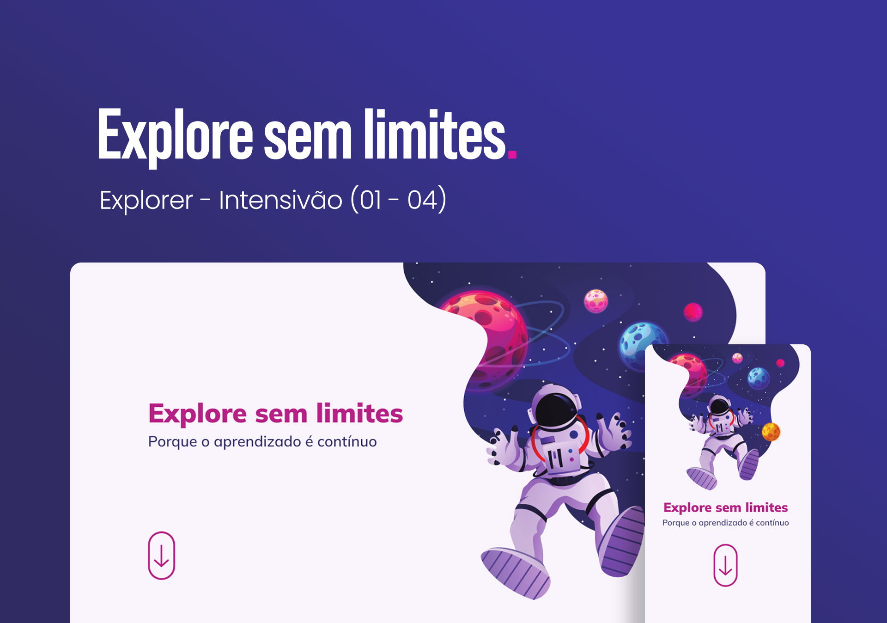

🚀 Tecnologias 

Esse projeto foi desenvolvido com as seguintes tecnologias:

<ul>
<li>HTML e CSS</li>
<li>JavaScript</li>
<li>Git e Github</li>
<li>Figma</li>
</ul>

💻 Projeto

O DevLinks é um agregador de links para usar como cartão de visitas online.

📝 Licença

Esse projeto está sob a licença MIT.

Esse projeto faz parte do Curso Discover desenvolvido pela Rocketseat.

